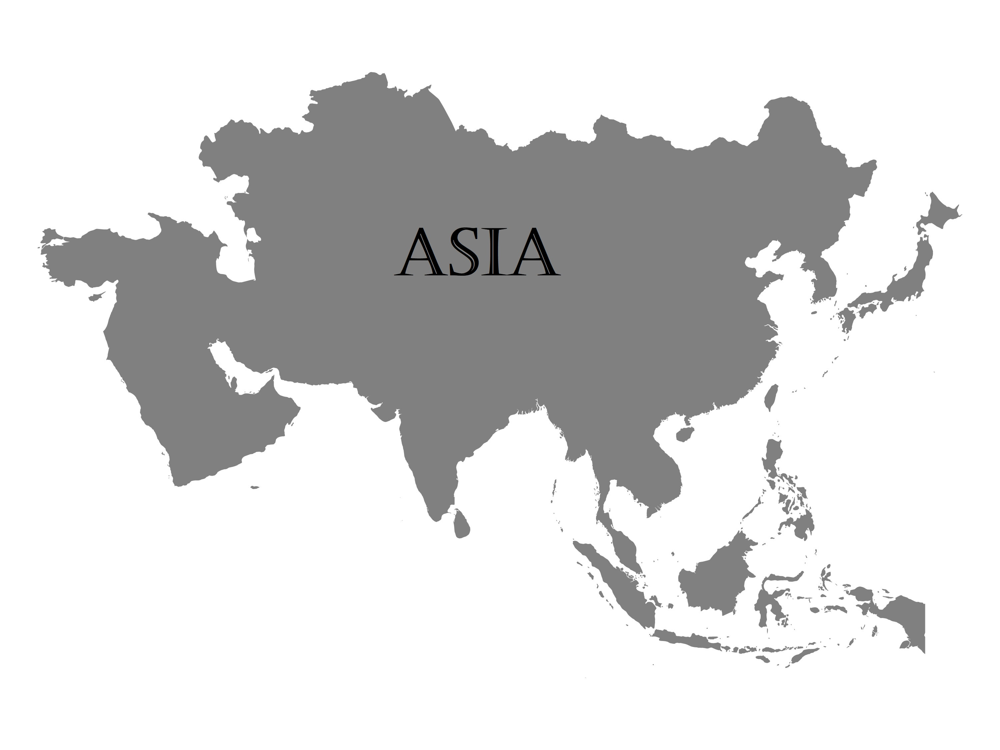
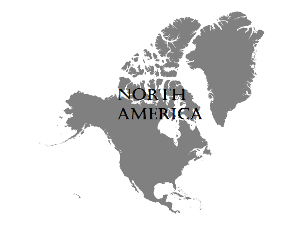
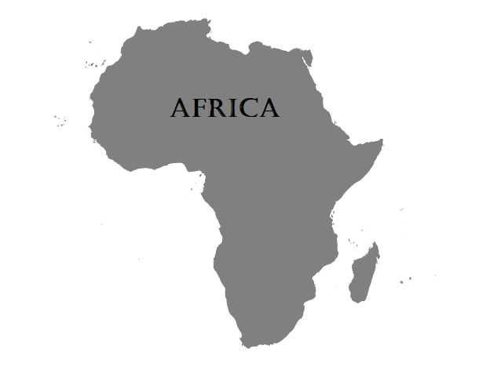
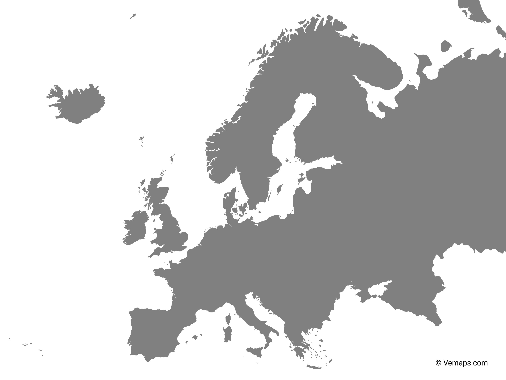
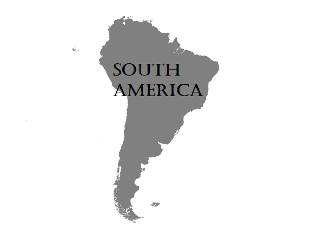

# VC_P6

# Detector de Continentes

Este proyecto utiliza DeepFace para analizar un rostro y obtener los porcentajes de parecido a lo que es considerado una cierta raza. Todo en un filtro con una ruleta de imágenes y música.

## Características

    Detección Facial en Tiempo Real: Utiliza la biblioteca OpenCV para detectar caras en tiempo real a través de la webcam.

    Análisis de Rostros: Emplea DeepFace para analizar las características faciales, clasificar y proporcionar porcentajes detallados.

    Interfaz Gráfica Interactiva: Permite la interacción del usuario mediante clics del mouse, capturando fotogramas específicos para un análisis detallado.

    Superposición de Imágenes: Superpone imágenes representativas de diferentes continentes sobre los rostros detectados.

    Música Temática Dinámica: Cambia la música de fondo según el continente predominante detectado.

## Uso

    1. Ejecuta el programa y apunta la webcam hacia un rostro.

    2. Haz clic en la ventana con la imagen para iniciar la ruleta.

    3. ?Tras unos segundos saldrá el resultado!

    4. Disfruta saber a qué continente parece que perteneces.

## Información Adicional

El programa va acompa?ado de imágenes en blanco y negro de los continentes, junto con música diferente para cada uno:

### Imágenes

- Asia  

- América

- África

- Europa

- Sudamérica

### Canciones

- Suavemente - Elvis Crespo
- The British Grenadiers
- The Lion King Opening
- Creedance Clear Water Survival - Fortunate Sun
- ???? (Xue Hua Piao Piao) - Yi Jian Mei